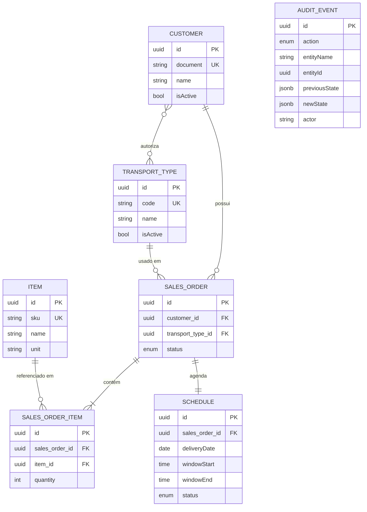
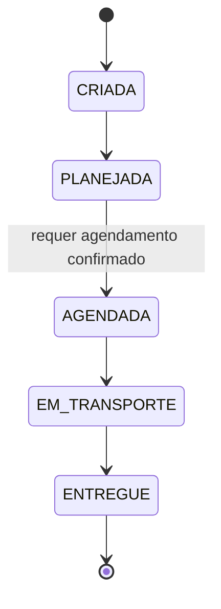

# OVGS API — Sistema de Gestão de Ordens de Venda

API REST para gerenciar o ciclo de vida de **Ordens de Venda (OV)**: cadastros
(clientes, tipos de transporte, itens), criação de OVs com regras de negócio,
máquina de estados do fluxo operacional, central de agendamento de entregas,
monitoramento com filtros e trilha de auditoria.

> Desafio técnico back-end. Foco em modelagem de domínio, separação de
> responsabilidades, decisões arquiteturais e qualidade (testes + cobertura).

---

## Tecnologias

- **Node.js 24** + **TypeScript**
- **NestJS 11** (arquitetura modular)
- **TypeORM** + **PostgreSQL 16** (migrations versionadas)
- **JWT** (`@nestjs/jwt` + `passport-jwt`) e **RBAC** (papéis `ADMIN`/`OPERATOR`)
- **class-validator / class-transformer** (validação de DTOs)
- **@nestjs/event-emitter** (auditoria orientada a eventos)
- **nestjs-pino** (logs estruturados + correlation id)
- **@nestjs/swagger** (OpenAPI em `/docs`)
- **@nestjs/terminus** (health check em `/health`)
- **Jest** + **Supertest** (testes unitários e e2e)
- **Docker Compose** (Postgres e aplicação)

---

## Pré-requisitos

- Node.js 24 (há um `.nvmrc`: `nvm use`)
- Docker + Docker Compose (para o PostgreSQL)

---

## Como executar

### 1. Desenvolvimento local (app no host, banco em container)

```bash
nvm use                       # Node 24
npm ci
cp .env.example .env          # ajuste se necessário

npm run db:up                 # sobe o PostgreSQL e aguarda ficar healthy
npm run migration:run         # aplica o schema
npm run seed                  # cria o usuário admin (admin@ovgs.local / admin12345)

npm run start:dev             # API em http://localhost:3000  (Swagger em /docs)
```

### 2. Stack completa via Docker Compose (API + banco em containers)

```bash
cp .env.example .env
npm run docker:up             # build + sobe api e postgres
# aplicar migrations no container:
docker compose exec api npm run migration:run
```

### 3. Testes

```bash
npm run db:up                 # e2e precisam do PostgreSQL
npm run test:cov              # unitários + relatório/gate de cobertura
npm run test:e2e              # integração (sobe a app, roda migrations no pretest)
```

---

## Variáveis de ambiente

| Variável | Descrição | Padrão (dev) |
|---|---|---|
| `NODE_ENV` | `development` \| `test` \| `production` | `development` |
| `PORT` | porta HTTP | `3000` |
| `DATABASE_HOST/PORT/USER/PASSWORD/NAME` | conexão PostgreSQL | `localhost:5432` / `ovgs` |
| `JWT_SECRET` | segredo de assinatura do JWT (**trocar em produção**) | dev placeholder |
| `JWT_EXPIRES_IN` | expiração do token | `1d` |
| `ADMIN_EMAIL` / `ADMIN_PASSWORD` | credenciais do seed | `admin@ovgs.local` / `admin12345` |

O `env` é **validado na inicialização** (`class-validator`); valores inválidos
abortam o boot com mensagem clara.

---

## Documentação da API

Swagger UI interativo em **`/docs`** (JSON em `/docs-json`). Clique em
**Authorize**, cole o `access_token` do login e teste qualquer endpoint.

Fluxo de autenticação:

```bash
# login
curl -X POST http://localhost:3000/auth/login \
  -H 'Content-Type: application/json' \
  -d '{"email":"admin@ovgs.local","password":"admin12345"}'
# => { "access_token": "..." }  → enviar como  Authorization: Bearer <token>
```

Principais recursos (todos sob JWT, exceto `/auth/login`, `/health` e `/docs`):

| Recurso | Endpoints | Observações |
|---|---|---|
| Auth | `POST /auth/login`, `GET /auth/me` | |
| Transport Types | `POST` (ADMIN), `GET`, `GET /:id`, `PATCH /:id` (ADMIN) | registro de modalidades |
| Customers | `POST`, `GET`, `GET /:id`, `PATCH /:id`, `PUT /:id/transport-types` | transportes autorizados |
| Items | `POST` (ADMIN), `GET`, `GET /:id` | catálogo com SKU |
| Sales Orders | `POST`, `GET` (filtros+paginação), `GET /:id`, `PATCH /:id/status`, `PATCH /:id/transport-type` | |
| Scheduling | `GET/PUT /sales-orders/:id/schedule`, `POST .../confirm`, `POST .../reschedule` | |
| Audit | `GET /audit` (ADMIN) | filtros `entityId`/`action` |
| Health | `GET /health` (público) | ping no banco |

Documentação detalhada de **todos os endpoints** (parâmetros, payloads e códigos
de resposta) em **[`docs/API.md`](docs/API.md)**.

### Coleção Postman

Em **[`postman/`](postman)** há uma coleção pronta e um environment:

1. Importe `postman/OVGS.postman_collection.json` e
   `postman/OVGS.postman_environment.json` no Postman.
2. Suba a API e rode o seed (`npm run seed`); selecione o environment **OVGS — Local**.
3. Rode a coleção no **Collection Runner** (na ordem das pastas): a pasta *Auth*
   captura o token automaticamente e cada criação encadeia os IDs nas variáveis.

A coleção cobre **todos os cenários** — caminhos felizes e erros
(400/401/403/404/409/422) — com testes de status em cada requisição (43 no total).
Os cenários de RBAC `403` exigem um token de usuário `OPERATOR` em `{{operatorToken}}`.

---

## Modelo de domínio



> `AUDIT_EVENT` e o `USER` (autenticação) ficam **desacoplados** por design: a
> auditoria referencia a entidade por `entityId`/`entityName` (sem FK) para ser
> append-only e independente do ciclo de vida das demais tabelas.

Regras centrais:

- Uma **OV** referencia **1 cliente**, **exatamente 1 tipo de transporte** e
  **≥ 1 item** (itens previamente cadastrados).
- A OV só é criada se o **transporte estiver autorizado para o cliente** (→ 422).
- **Tipos de transporte são dados** (não enum): novos tipos não exigem mudança de código.

### Fluxo operacional (máquina de estados)



- Apenas transições sequenciais são aceitas; o resto é rejeitado (→ 409).
- A transição para **AGENDADA exige um agendamento confirmado** (→ 422 caso contrário).

---

## Arquitetura

**NestJS modular em camadas** — cada módulo expõe `Controller` (HTTP/validação) →
`Service` (regra de negócio) → `Repository` (TypeORM/persistência), com `DTO`s de
entrada e exceções de domínio mapeadas para HTTP por um **filtro global**.

```
src/
  config/         validação de env
  common/         ValidationPipe + filtro de exceções + logging (cross-cutting)
  database/       DataSource, migrations, seeds
  auth/           JWT, guards globais, RBAC
  transport-types/ customers/ items/   cadastros
  sales-orders/   OV + itens, máquina de estados, scheduling (agregado)
  audit/          trilha de auditoria (listener de eventos)
  health/         healthcheck
```

Decisões e o porquê:

- **Núcleo transacional + auditoria orientada a eventos.** Os services emitem
  eventos de domínio (`@nestjs/event-emitter`); um `AuditListener` persiste a
  trilha. Isso **desacopla** a regra de negócio da gravação de auditoria e abre
  espaço para novos consumidores (EDA leve). Uso `emitAsync` para garantir a
  durabilidade da auditoria dentro da requisição.
- **Guards globais** (`JwtAuthGuard` + `RolesGuard`) com `@Public()`/`@Roles()`:
  seguro por padrão (tudo exige auth, salvo o que é explicitamente público).
- **Agendamento dentro do agregado de OV**, evitando dependência circular entre
  módulos e mantendo a invariante "AGENDADA exige agendamento confirmado" coesa.
- **Filtro de exceções único** padroniza o corpo de erro e centraliza o log.

As decisões arquiteturais estão registradas em detalhe nos
**[ADRs](docs/adr/)** (`docs/adr/`).

---

## Estratégia de persistência

- **PostgreSQL** com **TypeORM**; `synchronize: false` sempre — o schema evolui
  apenas por **migrations versionadas** (`migrations_history`), previsíveis e
  auditáveis.
- IDs `uuid`; auditoria usa `jsonb` para os estados anterior/posterior.
- O CLI de migrations roda sob `nodenext` via `tsconfig.cli.json` (override
  CommonJS); no runtime/testes as entidades são carregadas por `autoLoadEntities`
  (evita globs que não resolvem bem sob `ts-jest`).
- Seed idempotente para o usuário administrador.

---

## Testes

- **Unitários** (Jest) para services, guards, state machine, filtro e validações,
  com **gate de cobertura** (`statements`/`functions`/`lines` ≥ 90%; `branches` ≥ 80%
  — os branches restantes são artefatos de metadados de decorator do Nest nos
  construtores, não lógica).
- **Integração (e2e)** com Supertest sobe a aplicação real contra um PostgreSQL e
  cobre os fluxos: auth/RBAC, criação de OV e suas regras (422/404/400), máquina de
  estados, agendamento + guard de AGENDADA, monitoramento e auditoria.
- Métrica atual: **131 testes unitários + 45 e2e**.

### Como validar o teste

Validação automatizada completa (mesma sequência do CI):

```bash
nvm use && npm ci             # Node 24 + dependências
npm run lint                  # sem erros
npm run build                 # compila
npm run db:up                 # PostgreSQL (necessário p/ e2e)
npm run test:cov              # unitários + gate de cobertura
npm run test:e2e              # integração (roda migrations no pretest)
```

Resultado esperado:

- `test:cov` → **Test Suites: 25 passed**, **Tests: 131 passed**; `All files`
  com 100% em statements/functions/lines e branches ≥ 80% (o comando falha se a
  cobertura cair abaixo do limite).
- `test:e2e` → **Test Suites: 11 passed**, **Tests: 45 passed**.

### Validação manual do fluxo de negócio (API no ar)

Com `npm run start:dev` rodando e o admin semeado (`npm run seed`):

```bash
BASE=http://localhost:3000
TOKEN=$(curl -s -X POST $BASE/auth/login -H 'Content-Type: application/json' \
  -d '{"email":"admin@ovgs.local","password":"admin12345"}' \
  | sed -E 's/.*"access_token":"([^"]+)".*/\1/')
AUTH="Authorization: Bearer $TOKEN"

# cadastros
TT=$(curl -s -X POST $BASE/transport-types -H "$AUTH" -H 'Content-Type: application/json' \
  -d '{"name":"Caminhão","code":"TRUCK"}' | sed -E 's/.*"id":"([^"]+)".*/\1/')
IT=$(curl -s -X POST $BASE/items -H "$AUTH" -H 'Content-Type: application/json' \
  -d '{"sku":"SKU-1","name":"Caixa"}' | sed -E 's/.*"id":"([^"]+)".*/\1/')
CU=$(curl -s -X POST $BASE/customers -H "$AUTH" -H 'Content-Type: application/json' \
  -d "{\"name\":\"ACME\",\"document\":\"12345678000199\",\"authorizedTransportTypeIds\":[\"$TT\"]}" \
  | sed -E 's/.*"id":"([^"]+)".*/\1/')

# cria a OV (regra: transporte autorizado + >=1 item) -> status CRIADA
OV=$(curl -s -X POST $BASE/sales-orders -H "$AUTH" -H 'Content-Type: application/json' \
  -d "{\"customerId\":\"$CU\",\"transportTypeId\":\"$TT\",\"items\":[{\"itemId\":\"$IT\",\"quantity\":2}]}" \
  | sed -E 's/.*"id":"([^"]+)".*/\1/')

# fluxo: CRIADA -> PLANEJADA -> (agenda + confirma) -> AGENDADA
curl -s -X PATCH $BASE/sales-orders/$OV/status -H "$AUTH" -H 'Content-Type: application/json' -d '{"status":"PLANEJADA"}'
curl -s -X PUT   $BASE/sales-orders/$OV/schedule -H "$AUTH" -H 'Content-Type: application/json' \
  -d '{"deliveryDate":"2030-01-01","windowStart":"08:00","windowEnd":"12:00"}'
curl -s -X POST  $BASE/sales-orders/$OV/schedule/confirm -H "$AUTH"
curl -s -X PATCH $BASE/sales-orders/$OV/status -H "$AUTH" -H 'Content-Type: application/json' -d '{"status":"AGENDADA"}'

# trilha de auditoria da OV
curl -s "$BASE/audit?entityId=$OV" -H "$AUTH"
```

Para validar as **rejeições** (regras de negócio): tentar criar OV com transporte
não autorizado → **422**; com item inexistente → **404**; sem itens → **400**;
pular estado (ex.: CRIADA → ENTREGUE) → **409**; ir a AGENDADA sem agendamento
confirmado → **422**. Tudo isso também está coberto nos testes e2e.

> Alternativa visual: abra **`/docs`**, clique em **Authorize**, cole o token e
> exercite os endpoints pela própria interface do Swagger.

---

## Escalabilidade

- **Serviços stateless**: a API escala horizontalmente atrás de um balanceador.
- **Consultas paginadas** com filtros indexáveis (status, cliente, transporte,
  data) evitam varreduras completas; índices nas colunas de filtro/correlação.
- **Auditoria por eventos** permite, se necessário, mover a gravação para um
  worker/fila (ex.: outbox) sem tocar nas regras de negócio.
- Provisionamento/integrações externas (fora do escopo) caberiam naturalmente
  como consumidores assíncronos dos mesmos eventos de domínio.

## Performance

- Pool de conexões do PostgreSQL; relações carregadas seletivamente (`relations`
  só onde necessário — lista enxuta, detalhe completo).
- Logging estruturado de baixo overhead (pino); nível ajustável por ambiente.
- Build multi-stage no Docker (imagem de runtime só com dependências de produção).

---

## Trade-offs assumidos

- **`emitAsync` na auditoria** garante durabilidade dentro da requisição, ao custo
  de acoplar a latência da gravação; em alto volume, migraria para outbox + worker.
- **Repositório = TypeORM `Repository`** injetado nos services (em vez de uma
  abstração própria de repositório): menos boilerplate e adequado ao escopo;
  uma camada anticorrupção entraria se o domínio precisasse trocar de ORM.
- **`JWT_SECRET` com default de desenvolvimento** para rodar out-of-the-box;
  **deve** ser sobrescrito em produção.
- **Agendamento no módulo de OV** (não em módulo separado) prioriza a coesão do
  agregado e evita dependência circular.
- **Regras de disponibilidade do agendamento simplificadas** (coerência de janela
  e data não-passada), conforme permitido pelo desafio.

---

## Scripts úteis

| Script | Descrição |
|---|---|
| `npm run start:dev` | API em watch mode |
| `npm run db:up` / `db:down` / `db:reset` | PostgreSQL local (compose) |
| `npm run migration:generate -- src/database/migrations/Nome` | gera migration a partir das entidades |
| `npm run migration:run` / `migration:revert` | aplica / reverte migrations |
| `npm run seed` | cria o usuário admin |
| `npm run test` / `test:cov` / `test:e2e` | testes |
| `npm run docker:up` / `docker:down` | stack completa em containers |
| `npm run lint` / `build` | lint / compilação |
